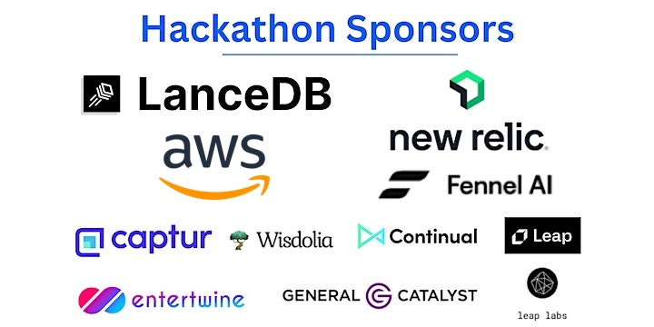

# 2023 AI x Product Hackathon

Welcome to the AI x Product Hackathon! Here is the [Eventbrite page](https://www.eventbrite.ie/e/ai-x-product-hackathon-tickets-616404240677).

This repository contains documentation, datasets, and starter code for the hackathon. Good luck and have fun!

## Products

### Challenge Sponsors

These products have specific challenges and prizes associated with them. Learn more about how to get started with these products and ideas for projects using them!

- [Amplitude](challenge-sponsors/amplitude/README.md): a product analytics tool that helps you understand what users are doing and build better products.
- [New Relic](challenge-sponsors/newrelic/README.md): an analytics and observability platform for troubleshooting and optimizing software performance.
- [LanceDB](challenge-sponsors/lancedb/README.md): a vector database designed for the complex requirements of large-scale AI and ML applications.
- [AWS](challenge-sponsors/aws/README.md): AI code generation with CodeWhisperer and LLM foundational models on SageMaker Jumpstart.
- [Fennel.ai](challenge-sponsors/fennelai/README.md): a fully-managed, realtime feature engineering platform for fast moving ML teams.

### Other Sponsors

These products are part of this hackathon and have a representative at the event. Check them out!

- [Leap AI](other-sponsors/leap-ai/README.md): a single API for everything AI.
- [Modal](other-sponsors/modal/README.md): end-to-end cloud compute for model inference, batch jobs, task queues, web apps, and more.
- [Entertwine](other-sponsors/entertwine/README.md): AI recommendation engine. Users can recommend/match/filter data in seconds with no current limit to the number of data points.

### Other Products

These products are not directly related to the hackathon, but we think you might be interested in using them.

- [SentenceTransformers](other-products/sentence-transformers/README.md): a Python library for state-of-the-art sentence, text, and image embeddings.
- [OpenAI](other-products/openai/README.md): powerful large language model APIs for chat, completion, and embedding.
- [Hugging Face](other-products/huggingface/README.md): a repository of ML models, and a platform for training/inference.

## Datasets

We've prepared some demo behavioral data that is particularly interesting for product analytics use cases.

- [Amplitude Demo Datasets](datasets/amplitude/README.md)

Here are some additional resources for datasets that might be interesting for you to build with.

- [Top Kaggle Datasets](https://www.kaggle.com/datasets?sort=votes)
- [Open Data on AWS](https://registry.opendata.aws/)
- [Microsoft Research Open Data](https://msropendata.com/)
- [Hugging Face Datasets](https://huggingface.co/datasets)
- [Awesome Public Datasets](https://github.com/awesomedata/awesome-public-datasets)
