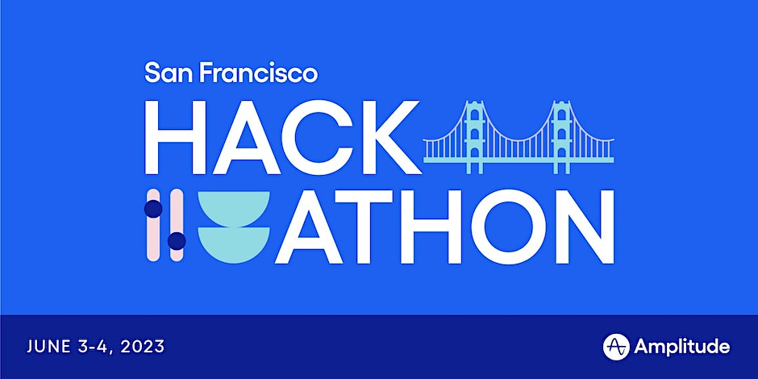

# 2023 AI x Product Hackathon

Welcome to the AI x Product Hackathon! Here is the [Eventbrite page](https://www.eventbrite.ie/e/ai-x-product-hackathon-tickets-616404240677).

This repository contains documentation, datasets, and starter code for the hackathon. Good luck!

## Products

### Challenge Sponsors

These products have specific challenges and prizes associated with them.

- [Amplitude](challenge-sponsors/amplitude/README.md): a product analytics tool that helps companies understand what their users are doing in order to build better products.
- [New Relic](challenge-sponsors/newrelic/README.md)
- [LanceDB](challenge-sponsors/lancedb/README.md)
- [Fennel.ai](challenge-sponsors/fennelai/README.md)

### Other Sponsors

These products are part of this hackathon and have a representative at the event.

### Other Products

These products are not directly related to the hackathon, but we think you might be interested in using them.

- [OpenAI](other-products/openai/README.md)
- [Databricks](other-products/databricks/README.md)
- [AWS SageMaker](other-products/sagemaker/README.md)
- [Hugging Face](other-products/huggingface/README.md)

## Datasets

Here are some resources for datasets that might be interesting for you to build with.

- [Amplitude Demo Datasets](datasets/amplitude/README.md)
- [Top Kaggle Datasets](https://www.kaggle.com/datasets?sort=votes)
- [Open Data on AWS](https://registry.opendata.aws/)
- [Microsoft Research Open Data](https://msropendata.com/)
- [Awesome Public Datasets](https://github.com/awesomedata/awesome-public-datasets)
